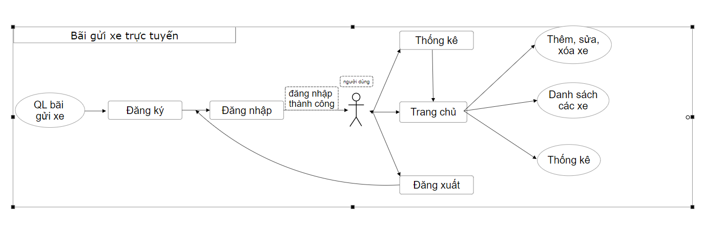
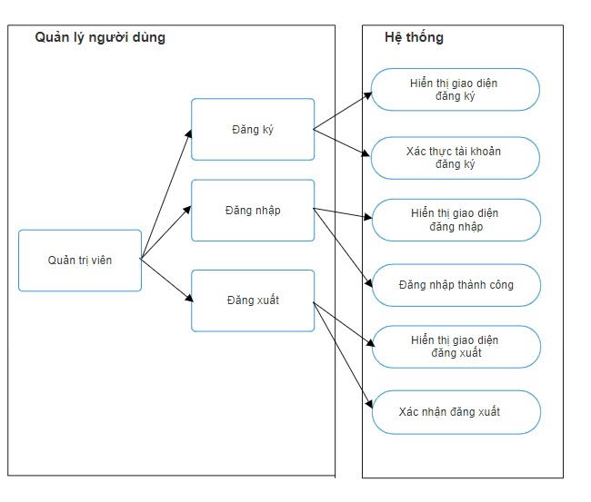
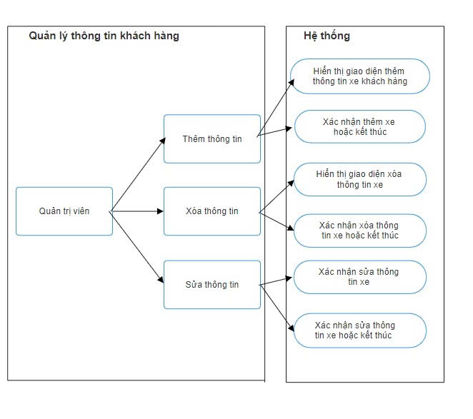
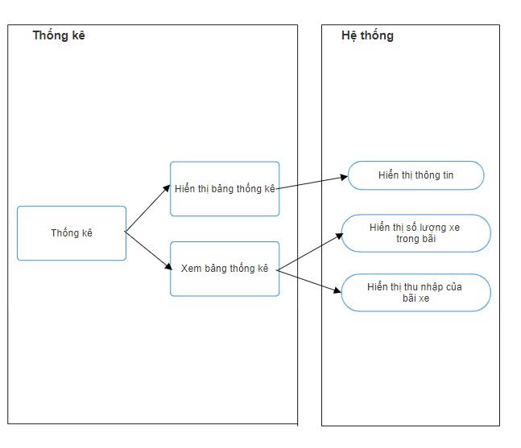
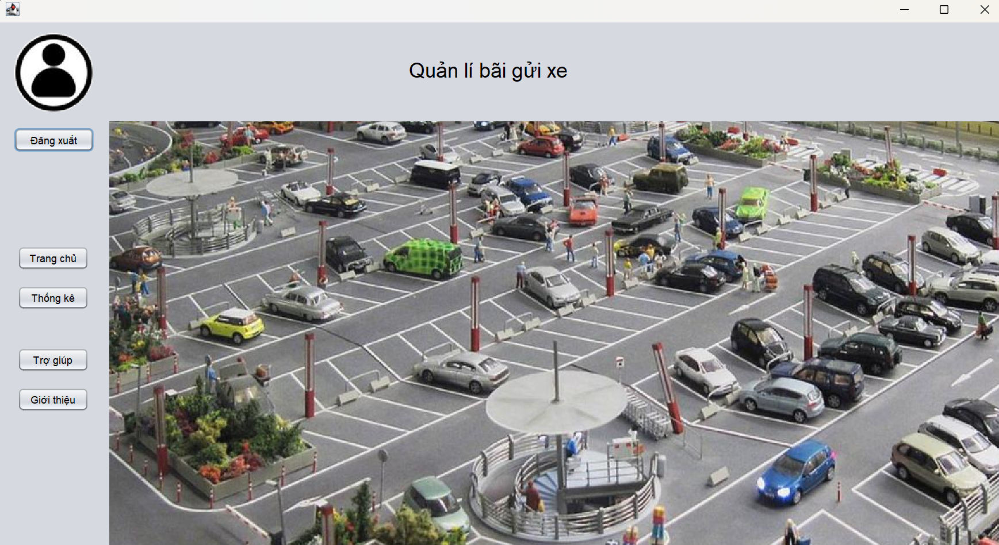

## OOP_Group18
# Hệ thống quản Lý bãi gửi xe
## Giới thiệu dự án
Dự án này là một hệ thống quản lý bãi gửi xe, giúp tối ưu hóa và cải thiện hiệu quả hoạt động của bãi gửi xe. Hệ thống cho phép quản lý thông tin chủ xe, xe và thống kê ngày ra vào bãi.
## Thành viên nhóm
1. Đoàn Tiến Dũng : Phát triển phần mềm toàn diện.
2. Đoàn Thị Thanh Trúc: Phát triển phần mềm toàn diện.
## Chức năng chính
* Thêm, sửa, xóa xe của khách hàng
* Lấy thông tin chủ xe, biển số xe, ngày ra, vào bãi
* Thống kê số xe trong bãi và thu nhập của bãi xe
# UML Dự Án
## 1. UML Communication Diagram

## 2. UML Use-case
### Use-case quản lý người dùng 
 
### Use-case quản lý khách hàng 
 
### Use-case thống kê 
 
# Giao diện dầu tiên của dự án
 
# GitHub Pages Dự Án

