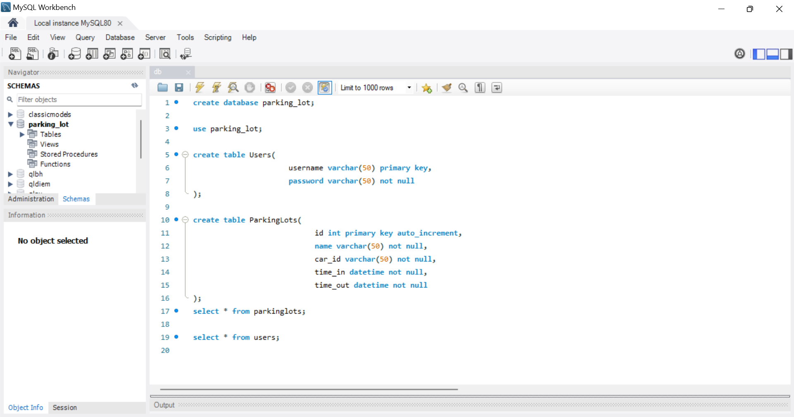
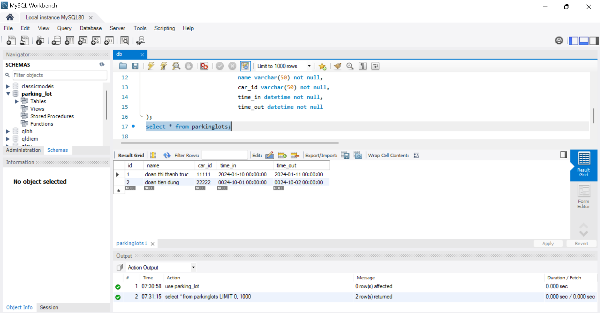
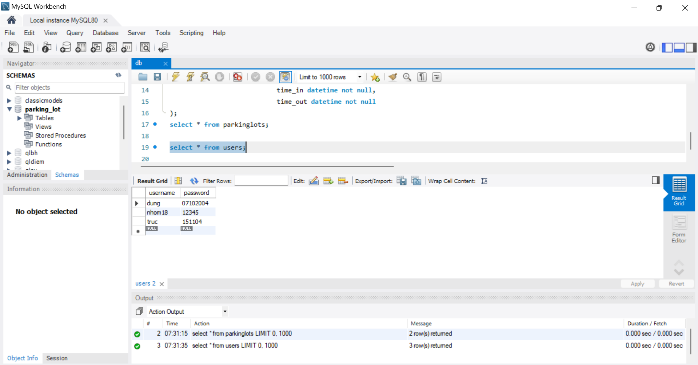
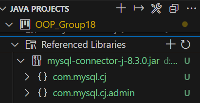
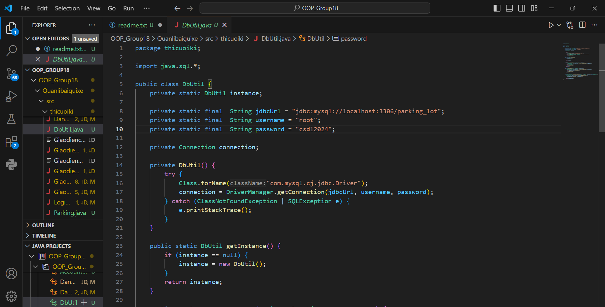
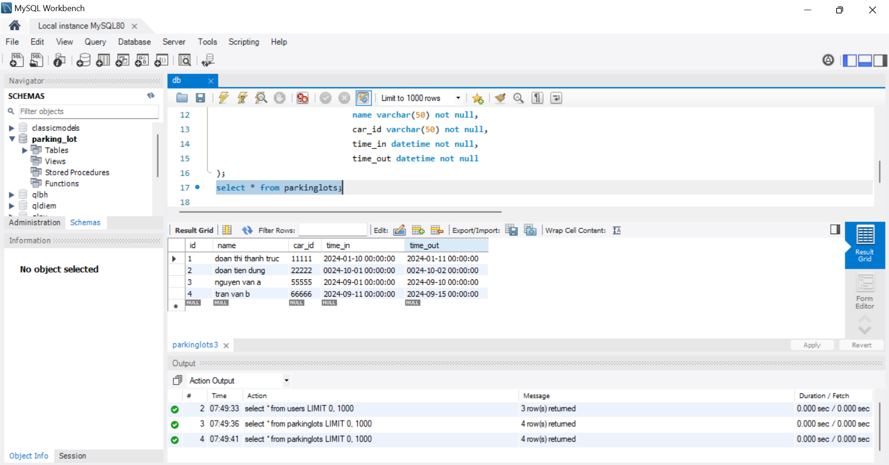

## 1. Thực hiện tạo database

## 2. Thực hiện chạy finalProject.sql  trên hệ quản trị CSDL mySQL

## 3. Cài đặt JDBC driver và thư viện mysql-connecter-java trong finalProject

## 4.Kết nối tới CSDL trong finalProject thông qua Connection String

## 5. Thực hiện tạo lưu dữ liệu từ các đối tượng lên hệ quản trị cơ sở dữ liệu quan hệ MySQL kể trên để hoàn thiện bài tập cuối kỳ

